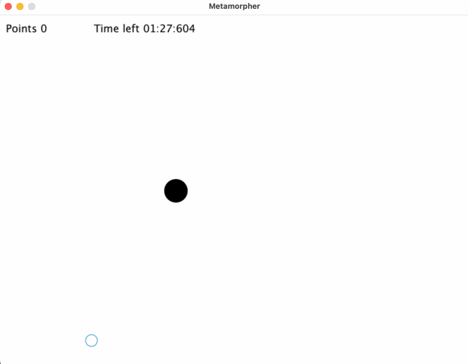

 # OOP1 EN2 HS23

## Thema
In diesem Programmierprojekt geht es darum, das folgende Spiel zu programmieren:


<p>Abbildung 1: Metamorpher Gameplay</p>

Das Spiel wird durch mehrere Vorgaben definiert:
- [Rahmenbedingungen](#rahmenbedingungen)
- [Nicht Funktionale Anforderungen](#nicht-funktionale-anforderungen)
- [Funktionale Anforderungen](#funktionale-anforderungen)

Bevor Sie beginnen, lesen Sie bitte alle Vorgaben sorgfältig durch und schauen Sie sich dieses [**Video**](https://tube.switch.ch/videos/CsH9u29Zbh) an.

## Rahmenbedingungen
Folgende Rahmenbedingungen müssen eingehalten werden:
- (R1) Für die Implementierung des Spiels können Arrays oder Listen verwendet. Eine kurze Einführung zu Listen finden Sie [hier](https://tube.switch.ch/videos/4bce96c3).
- (R2) Diese Prüfung ist eine **Einzelarbeit**. Gemäss Prüfungsordnung resultiert ein Verstoss gegen diese Bedingung mit der **Note 1**.
- (R3) Der/die AutorIn bleibt anonym. Es stehen also keine Namen, E-Mail-Adressen etc. in den abgegebenen Artefakten.
- (R4) Es muss die GUI-Library verwendet werden, welche wir für das Pong-Spiel verwendet haben. Sonst dürfen, neben den Java Standard Libraries, keine zusätzlichen Abhängigkeiten verwendet werden.
- (R5) Github Copilot, ChatGPT, etc. dürfen verwendet werden. Sie müssen den Code, den Sie abgeben, erklären können.
- (R6) Ihre Lösung muss von den anderen Studierenden kompiliert und gestartet werden können. Falls Sie nicht VS Code verwenden, müssen Sie trotzdem kontrollieren, dass Ihre Abgabe mit VS Code funktioniert. Verwenden Sie nur Sprachkonstrukte, die wir auch im Unterricht (Slides, Arbeitsblätter, Übungen) verwendet haben.

## Nicht Funktionale Anforderungen
Die nicht funktionalen Anforderungen werden durch die Kriterien **NF1** (Code Organisation), **NF2** (Code Kommentare) und **NF3** (UML Klassendiagramm) festgelegt und sind weiter unten in den Kriterien [beschrieben](#bewertung-nicht-funktionale-kriterien).

## Funktionale Anforderungen
Die funktionalen Anforderungen werden durch die Kriterien **F1** - **F19** festgelegt und sind weiter unten in den Kriterien [beschrieben](#bewertung-funktionale-kriterien).
Zusätzlich zu den Kriterien definiert dieses [**Video**](https://tube.switch.ch/videos/CsH9u29Zbh) die funktionalen Anforderungen an das Spiels. Das Video (nicht das animierte GIF, sondern das Video auf SwitchTube) ist also Teil der Spezifikation.

## Aufgaben

### 1. Game implementieren
Das Spiel soll sich so verhalten, wie im Video gezeigt.

Am besten gehen Sie diese Aufgabe in der folgenden Reihenfolge an. Dieser Hinweis ist eine Empfehlung. Sie können die Aufgabe in beliebiger Reihenfolge lösen:
1. Beginnen Sie mit der Spielfigur: Die Spielfigur soll erscheinen und bewegbar sein.
2. Fügen Sie einen Morph im Meta-Stadium hinzu.
3. Kümmern Sie sich um das zufällige Erscheinen (zeitlich, örtlich).
4. Implementieren Sie den Übergang vom Meta-Morph zum Killer-Morph.
5. Fügen Sie die zufälligen Bewegungen des Killer-Morphs hinzu.
6. Jetzt können Sie den Prey-(Beute)-Morph implementieren.
7. Nun ist es Zeit, die Kollisionen mit den Morphs zu erkennen und die entsprechenden Reaktionen darauf zu implementieren.
8. Dann die Punkte- und Zeitanzeigen implementieren.
9. Zum Schluss den Sieger- und den Verlierer-Bildschirm umsetzen.

#### MorphDNA
Die Morphs haben unterschiedliche Charakteristika. Diese werden durch die DNA (Punkte, Farbe) bestimmt. Die nachfolgenden Bewertungskriterien nehmen Bezug auf die _MorphDNA_. 

```java 
// Punkte, Farbe
TURQUOISE(1, new Color(6, 188, 156)), 
GREEN(5,     new Color(46, 204, 113)),
BLUE(10,     new Color(52, 152, 219)),
VIOLET(20,   new Color(155, 89, 182)),
YELLOW(40,   new Color(241, 196, 15)),
ORANGE(70,   new Color(230, 126, 34)),
RED(99,      new Color(231, 76, 60));
```

Ein ausgewachsener Morph hat einen Radius von **20 Pixeln**. 

### 2. Struktur analysieren und UML Klassendiagramm zeichnen
1. Zeichnen Sie für Ihre Lösung ein UML Klassendiagramm. Dieses Diagramm soll folgende Eigenschaften haben:
   - Alle selbst geschriebenen Klassen, Enums und Interfaces **und deren Vererbungsbeziehungen** müssen ersichtlich sein.
   - Attribute und Operationen, Referenzen etc. müssen nicht abgebildet werden.
2. Geben Sie das Klassendiagramm als Bilddatei mit dem Namen `uml-klassendiagramm.png` oder `uml-klassendiagramm.jpg` ab. Legen Sie das Bild im Wurzelverzeichnis des Projektes ab (analog zu diesem README.md).

## Hinweis zum Arbeitsaufwand
Das Lösen dieser Aufgaben entspricht dem Arbeitsaufwand für zwei Wochen im Modul OOP1, also in etwa einer Arbeitszeit von **12 Stunden** (siehe auch OOP1 Drehbuch). Das ist eine Schätzung und auch eine Empfehlung. Beginnen Sie frühzeitig mit der Arbeit.

## Bewertungskriterien
- 6 Punkte werden für nicht funktionale Kriterien vergeben (je 2 Punkte pro Kriterium)
- 19 Punkte werden für funktionale Kriterien vergeben (je 1 Punkt pro Kriterium)

Die Kriterien folgen dem **Alles oder Nichts** Prinzip - für halb erfüllte Kriterien gibt es **0 Punkte**.

### Bewertung Nicht Funktionale Kriterien

#### **(NF1) Code Organisation**
Der Code ist auf mindestens drei Packages aufgeteilt. Keine Klasse ist länger als 300 Zeilen und keine Methode ist länger als 50 Zeilen.
- (a) Nein
- (b) Ja

#### **(NF2) Code Kommentare**
Jede Klasse und jede public Methode und jede public Konstante ist mit einem JavaDoc Kommentar versehen.
- (a) Nein
- (b) Ja

#### **(NF3) UML Klassendiagramm**
Das Klassendiagramm zeigt alle selbst definierten Klassen, Interfaces und Enums sowie deren Vererbungshierarchie (extends und implements).
- (a) Nein
- (b) Ja


### Bewertung Funktionale Kriterien
> Generell gilt: Das Verhalten ist so zu implementieren, wie im Video gezeigt. Das Video ist die Spezifikation.

#### **[(F1) Spieler Darstellung](https://tube.switch.ch/videos/CsH9u29Zbh#2:16)**
Die Spielfigur wird als schwarzer Kreis dargestellt, erscheint am Anfang des Spiels in der Mitte des Fensters und lässt sich mit den vier Pfeiltasten korrekt in die jeweiligen Richtungen bewegen.
- (a) Nein
- (b) Ja

#### **[(F2) Spieler Wrap-Around](https://tube.switch.ch/videos/CsH9u29Zbh#2:45)**
Wenn die Spielfigur auf in einer Richtung das Fenster verlässt, erscheint sie auf der gegenüberliegenden Seite wieder.
- (a) Nein
- (b) Ja

#### **[(F3) Morph Spawn](https://tube.switch.ch/videos/CsH9u29Zbh#3:20)**
Morphs entstehen an zufälligen Orten. Es wird nur eine bestimmte Anzahl Morphs erzeugt. 
Die Anzahl ist über eine Konstante mit dem Namen `INITIAL_MORPH_COUNT` konfiguriert. (Muss im Code verifiziert werden.)
Die DNA eines Morphs [MorphDNA](#morphdna) wird zufällig gewählt.
- (a) Nein
- (b) Ja

#### **[(F4) Morph Darstellung: Meta-Phase](https://tube.switch.ch/videos/CsH9u29Zbh#4:42)**
Morphs in der Meta-Phase wachsen an dem Ort, an dem sie initial aufgetaucht sind. Sie werden als wachsender Ring dargestellt. Der Ring wird in der ursprünglich gewählten Farbe dargestellt.
- (a) Nein
- (b) Ja

#### **[(F5) Morph Verhalten und Interaktion: Meta-Phase](https://tube.switch.ch/videos/CsH9u29Zbh#5:18)**
In der Metaphase haben die Morphs keinen Effekt auf die Spielfigur. Die Spielfigur kann sich durch die Morphs hindurch bewegen.
- (a) Nein
- (b) Ja

#### **[(F6) Morph Übergang: Meta-Phase - Killer-Phase](https://tube.switch.ch/videos/CsH9u29Zbh#5:53)**
Wenn ein Meta-Morph seine Grösse erreicht hat, verwandelt er sich in einen Killer-Morph.
- (a) Nein
- (b) Ja

#### **[(F7) Morph Darstellung: Killer-Phase](https://tube.switch.ch/videos/CsH9u29Zbh#5:53)**
In der Killer-Phase werden die Morphs als ausgefüllte Kreise dargestellt.
- (a) Nein
- (b) Ja

#### **[(F8) Morph Bewegung (1): Killer-Phase](https://tube.switch.ch/videos/CsH9u29Zbh#6:44)**
In der Killer-Phase bewegt sich ein Morph zufällig: Richtung und Geschwindigkeit ändern alle `n` Zeitschritte zufällig, wobei auch `n` zufällig ist.
- (a) Nein
- (b) Ja

#### **[(F9) Morph Bewegung (2): Killer-Phase](https://tube.switch.ch/videos/CsH9u29Zbh#6:44)**
Wenn ein Morph in einer Richtung das Fenster verlässt, erscheint er auf der gegenüberliegenden Seite wieder (Wrap-Around).
- (a) Nein
- (b) Ja

#### **[(F10) Morph Interaktion: Killer-Phase](https://tube.switch.ch/videos/CsH9u29Zbh#8:02)**
Wenn ein Morph in der Killer-Phase die Spielfigur berührt, ist das Spiel zu Ende.
- (a) Nein
- (b) Ja

#### **[(F11) Morph Darstellung: Prey-Phase](https://tube.switch.ch/videos/CsH9u29Zbh#9:28)**
In der Prey-Phase wird ein Morph als ausgefüllter Kreis mit der Farbe und der Anzahl Punkte aus der [MorphDNA](#morphdna) dargestellt.
- (a) Nein
- (b) Ja

#### **[(F12) Morph Interaktion: Prey-Phase](https://tube.switch.ch/videos/CsH9u29Zbh#9:28)**
Wenn die Spielfigur mit einem Morph in der Prey-Phase kollidiert, verschwindet der Morph und die Spielfigur erhält die entsprechenden Punkte.
- (a) Nein
- (b) Ja

#### **[(F13) Morph Übergang: Prey-Phase - Killer-Phase](https://tube.switch.ch/videos/CsH9u29Zbh#9:28)**
Nach ungefähr 5 Sekunden verwandelt sich ein Morph in der Prey-Phase wieder in einen Killer-Morph.
Bevor ein Prey-Morph wieder zu einem Killer wird, blinkt die Punktzahl für die letzten zwei Sekunden.
- (a) Nein
- (b) Ja

#### **[(F14) Morph Respawn](https://tube.switch.ch/videos/CsH9u29Zbh#11:49)**
Wenn ein Morph vom Spieler gefressen wird, werden zwei neue Morphs erzeugt (einer verschwindet, zwei neue kommen dazu).
- (a) Nein
- (b) Ja

#### **[(F15) Zeit Anzeige](https://tube.switch.ch/videos/CsH9u29Zbh#12:42)**
Ein Spiel dauert 90 Sekunden. Die verbleibende Zeit wird dargestellt. Die Anzeige soll das folgende Format haben: Minuten 2 Stellen, Sekunden 2 Stellen und Millisekunden 3 Stellen, jeweils durch einen Doppelpunkt getrennt. Beispiel: `01:09:063`.
- (a) Nein
- (b) Ja

#### **[(F16) Punkte Anzeige](https://tube.switch.ch/videos/CsH9u29Zbh#12:42)**
Die erreichten Punkte werden aufsummiert dargestellt.
- (a) Nein
- (b) Ja

#### **[(F17) Spiel Ende: Erfolg](https://tube.switch.ch/videos/CsH9u29Zbh#13:50)**
Wenn die 90 Sekunden ohne Kollision mit einem Killer-Morph überstanden sind, wird ein "You Win" Screen angezeigt.
Die Punkte werden dargestellt.
- (a) Nein
- (b) Ja

#### **[(F18) Spiel Ende: Niederlage](https://tube.switch.ch/videos/CsH9u29Zbh#8:02)**
Wenn die Spielfigur mit einem Killer-Morph kollidiert, wird ein "Game Over" Screen angezeigt. Die Verbleibende Zeit und der Punktestand werden angezeigt.
- (a) Nein
- (b) Ja

#### **[(F19) Restart](https://tube.switch.ch/videos/CsH9u29Zbh#8:02)**
Mit der Leertaste kann das Spiel neu gestartet werden. Die Zeit und die Punkte werden zurückgesetzt. Die Morphs werden neu generiert. Anzahl der Morphs entspricht wieder dem `INITIAL_MORPH_COUNT`.
- (a) Nein
- (b) Ja

## Abgabe der Arbeit
Abgabetermin: **Donnerstag, 14.12.2023 23.59**.

Zur Abgabe müssen Sie eine anonyme Version Ihrer Lösung in der [Peergrading Webapplikation](https://www.cs.technik.fhnw.ch/peergrading/) hochladen. 
Sie können so häufig hochladen wie Sie möchten. Die letzte Abgabe vor der Deadline wird dann bewertet.

Gehen Sie dazu wie folgt vor:
1. Erstellen Sie eine Kopie des Ordners, der Ihre Lösung enthält.
2. Nennen Sie diesen Ordner `EN2_Metamorpher` 
3. Löschen Sie darin alle Dateien, die Ihre Identität preisgeben könnten. 
   Beispiele:
   - `.git` Ordner
   - IDE Metadaten wie `.project` und `*.iml`
4. Dann komprimieren Sie diesen Ordern:
   - WIN: Rechtsklick  "Send To" > compressed (zipped) folder
   - OSX: Rechtsklick "compress "EN2_Metamorpher"
5. Dieses Archiv laden Sie dann hoch.